# 🎫 Ticket Management System

A full-stack role-based service request management system built using Spring Boot, React, and MySQL.

---

## 🧩 Features

- 🔐 JWT Authentication
- 👥 Role-based access (ADMIN, AGENT, USER)
- 🎫 Create and manage tickets
- 📊 Dashboard with ticket statistics
- 📧 Email notifications for new users(Admin/Agent)
- ⚡ Auto-assign open tickets to agents
- 🔍 Search and pagination
- 🛡 Password validation and secure login
- 🚨 Report agents to admin
- 💬 Comment system for discussion
- 🔄 Ticket lifecycle:
  - OPEN
  - IN_PROGRESS
  - RESOLVED
  - CLOSED
- 🎯 Priority levels:
  - LOW
  - MEDIUM
  - HIGH
  - URGENT

---

## 🛠 Tech Stack

### Backend
- Java
- Spring Boot
- Spring Security
- JPA / Hibernate
- MySQL
- JWT (jjwt)

### Frontend
- React.js
- React Router
- Axios
- Bootstrap

---

## 👤 Roles

- **USER** → Create tickets and comment
- **AGENT** → Manage assigned tickets and update status
- **ADMIN** → Manage users, assign tickets, view statistics

---

## 📌 Status

✅ Completed and ready for deployment

---
## 📸 Screenshots

### Register
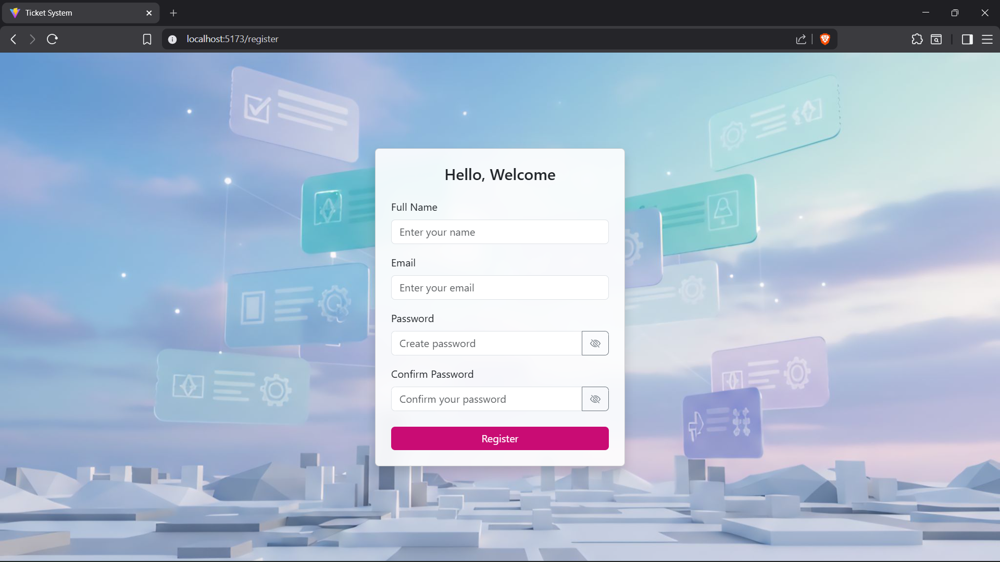

### Login Page
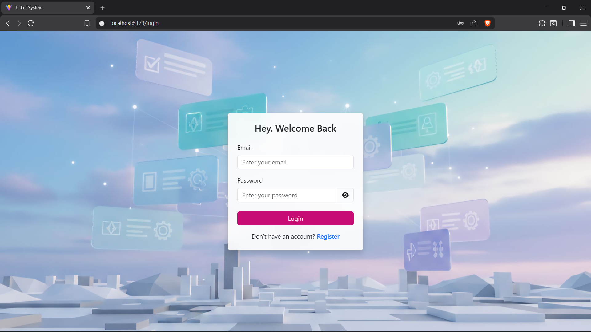

### Admin Dashboard
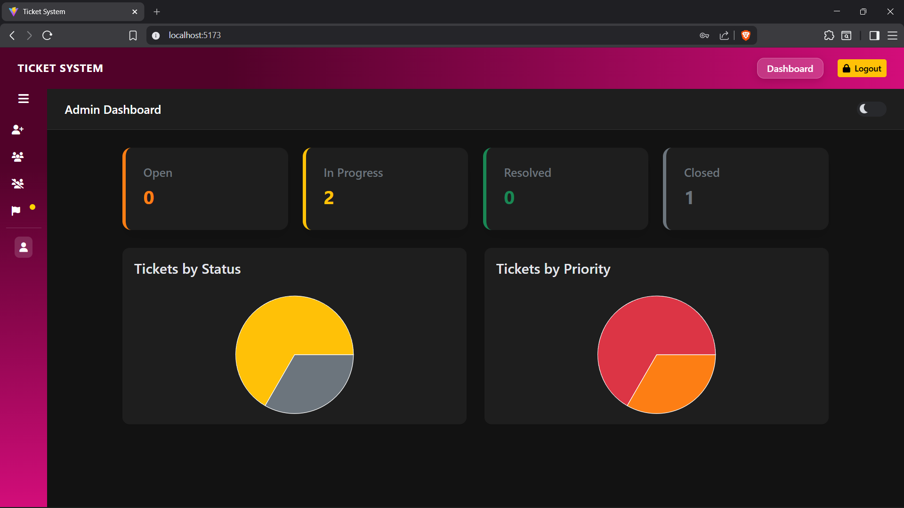

### Admin Dashboard Sidebar
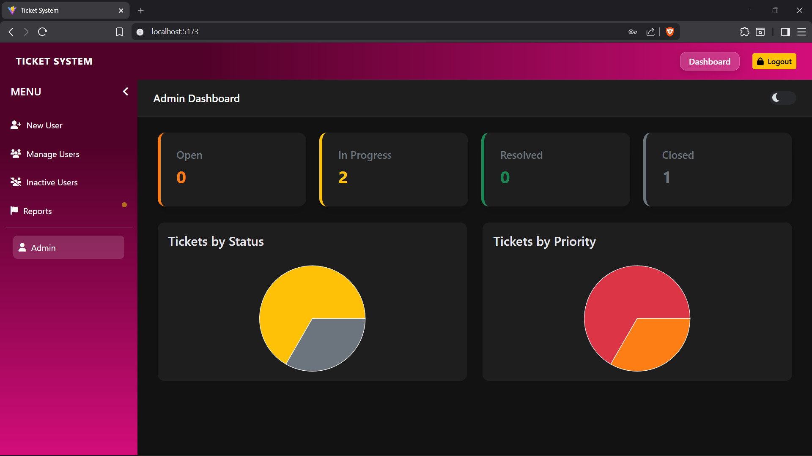

### Admin Auto Assign Tickets
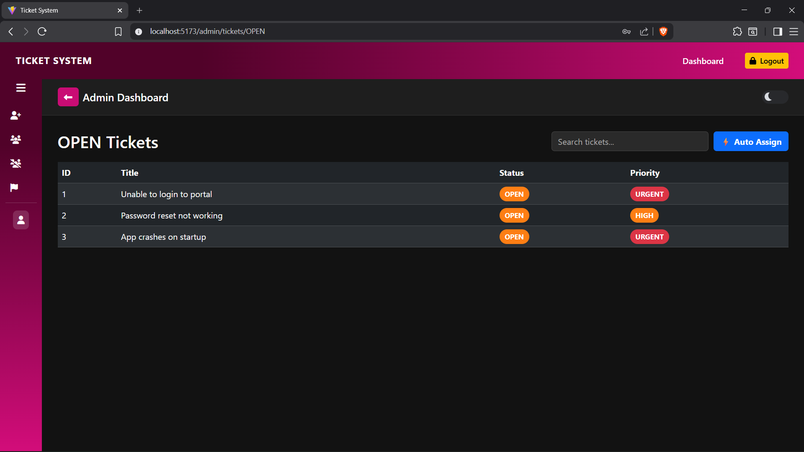

### Admin Assign Ticket
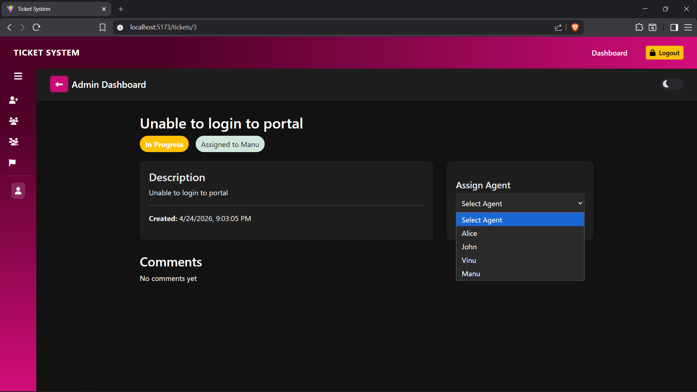

### Admin Create Admin/Agent
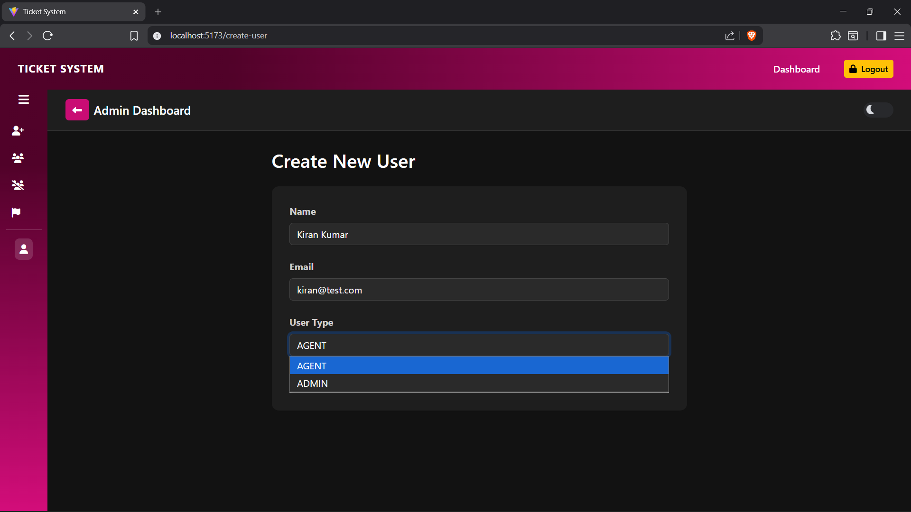

### Admin User Details
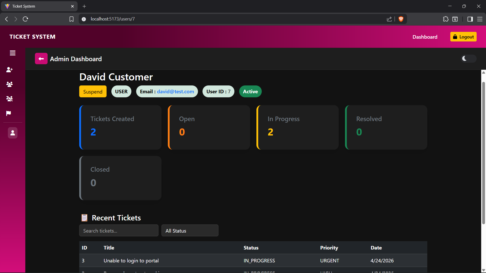

### Admin Reports
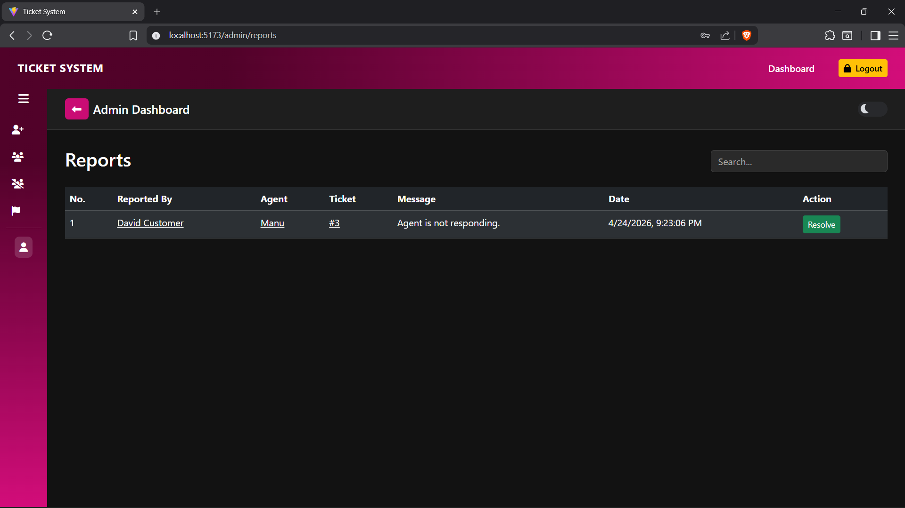

### Agent Dashboard
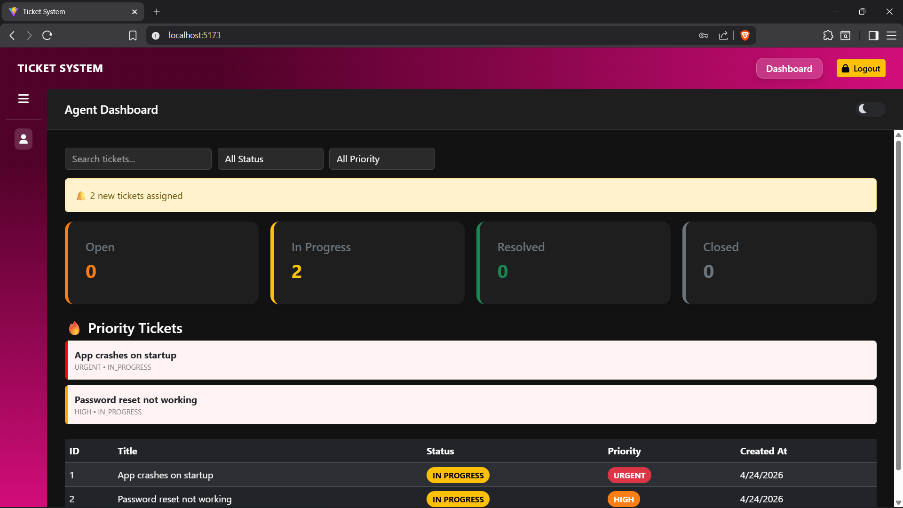

### Ticket Details
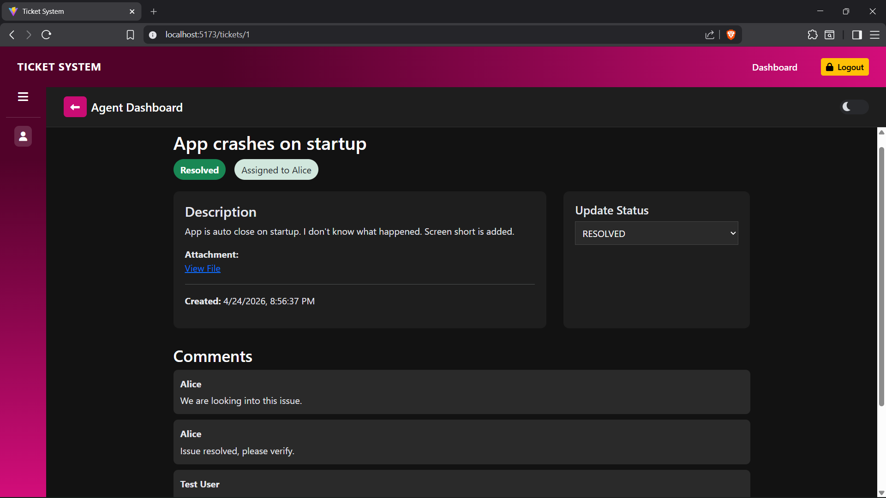

### Manage Users
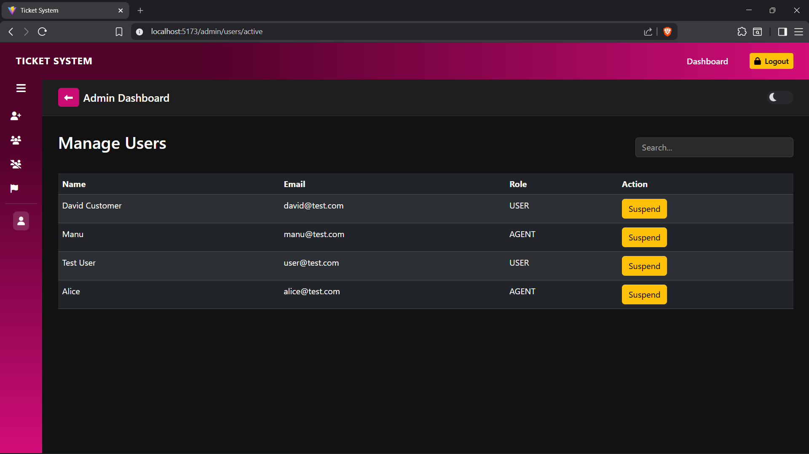

### Inactive Users
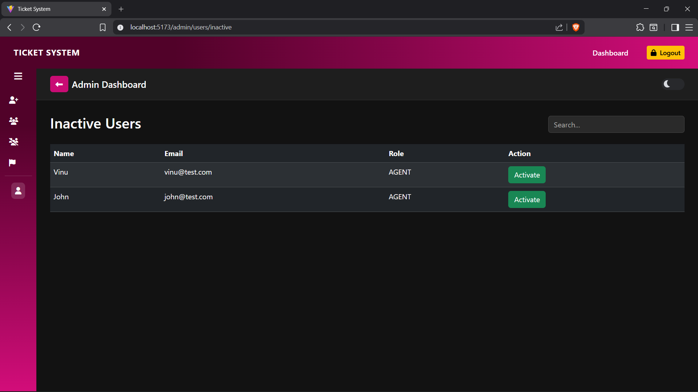

### New Password
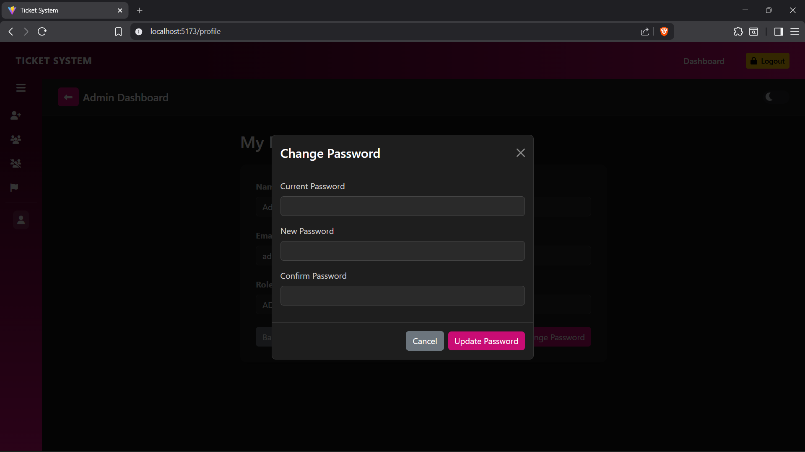

### Report Agent
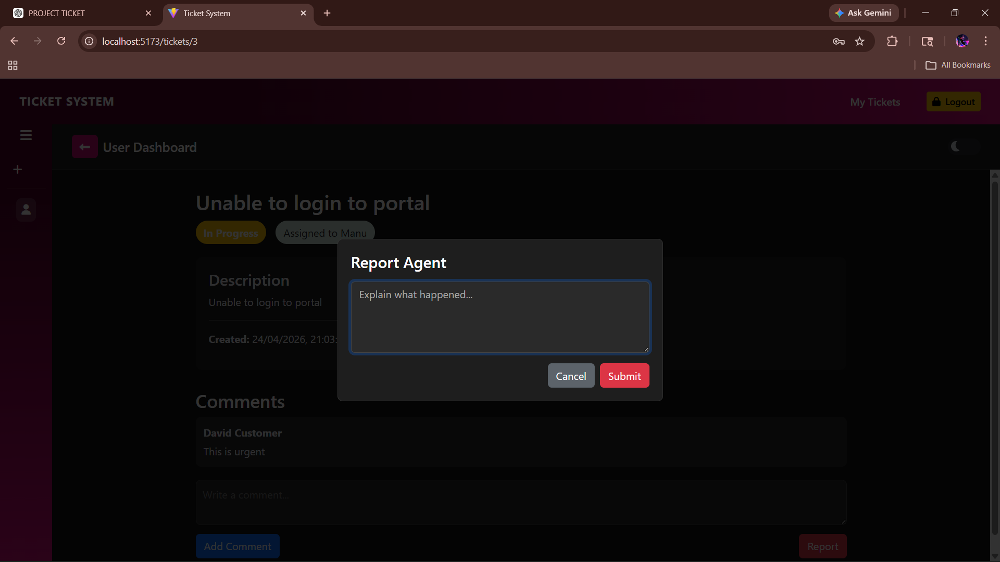

### User Dashboard
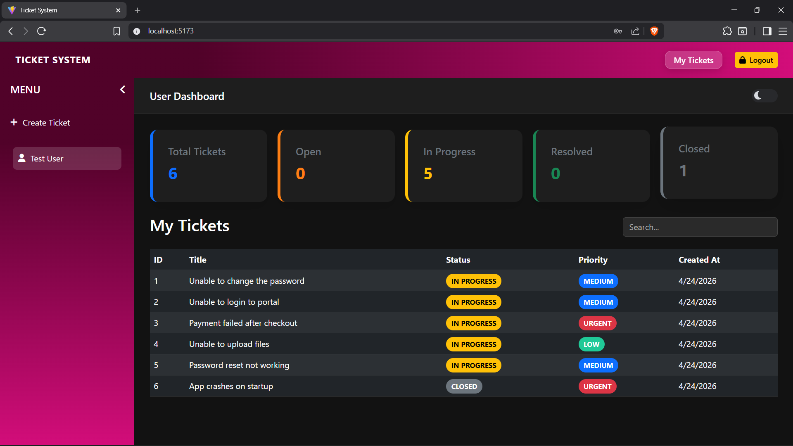

### Create Ticket
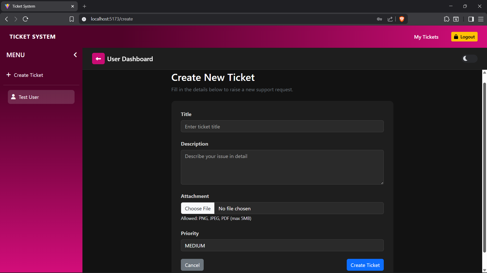

## 👨‍💻 Author

Adarsh A S  
B.Tech Computer Science Engineering (2025)
